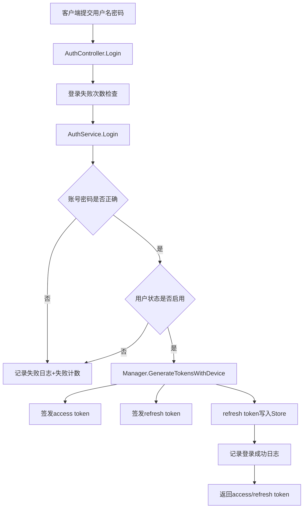
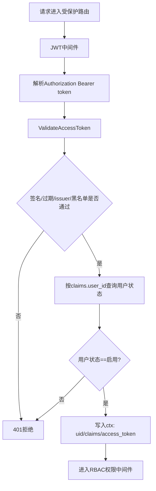
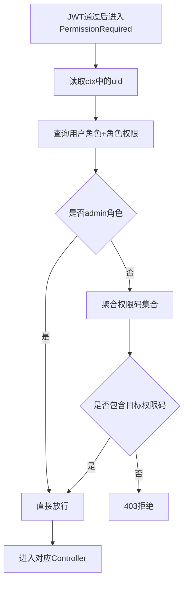

# JWT 与 RBAC 代码流程详解

## 1. 总体目标
本项目的权限体系由两层组成：

1. JWT 认证：先确认“你是谁”
2. RBAC 授权：再确认“你能做什么”

只有 JWT 认证通过且 RBAC 权限码匹配，请求才会进入业务控制器。

## 2. 关键代码入口

- 启动入口：`main.go` -> `cmd/godash/root.go`
- 服务装配：`internal/server/server.go`、`internal/server/router.go`
- JWT 核心：`internal/token/jwt/manager.go`、`internal/token/jwt/parser.go`、`internal/middleware/jwt.go`
- Token 存储：`internal/token/store/store.go`
- RBAC 核心：`internal/middleware/permission.go`、`internal/services/user_role_service.go`
- 路由聚合：`internal/routes/rbac_routes.go`

## 3. JWT 流程

### 3.1 登录签发流程（`POST /auth/login`）

### 3.2 Access Token 校验流程（所有受保护接口）

### 3.3 刷新令牌流程（`POST /auth/refresh`）

1. 控制器先解析 `refresh_token` 的 claims，要求 `token_type=refresh`。
2. 控制器查询用户状态，禁用用户直接拒绝刷新。
3. `Manager.RefreshTokenPair` 校验 Store 中保存值是否一致。
4. 通过后轮换签发新的 access/refresh 对。

### 3.4 登出流程（`POST /auth/logout`）

1. 从 JWT context 中拿到当前用户与设备信息。
2. 删除该设备对应 refresh token（`InvalidateRefresh`）。
3. 将当前 access token 写入黑名单（`RevokeAccessToken`）。

## 4. RBAC 流程

### 4.1 权限校验流程（`PermissionRequired`）

### 4.2 菜单权限流程（`GET /api/menus/frontend/tree`）

1. 先通过 JWT + `sys:menu:frontend` 权限码。
2. `MenuDAO.ListByUserID` 按 `user_roles -> role_permissions -> menu_permissions` 关联查可见菜单。
3. `MenuService.BuildMenuTreeFromList` 构建树并返回。
4. 若子节点父菜单未命中（权限缺失），会降级为根节点避免前端丢菜单。

## 5. 数据来源与初始化关系

- `server.go` 的 `AutoMigrate`：仅做表结构对齐。
- `database/mysql/001_rbac_schema_and_seed.sql`：负责完整表结构约束与初始化数据（角色、权限、菜单、admin）。

结论：程序启动不会自动执行该 SQL 文件，需要你手动执行（或接入专用迁移工具）。

## 6. 你最常看的调试路径

1. 登录失败排查：`AuthController.Login` -> `AuthService.Login`
2. Token 问题：`token/jwt/parser.go`、`token/jwt/manager.go`
3. 权限不足：`middleware/permission.go` + `user_roles/role_permissions` 数据
4. 菜单不显示：`MenuDAO.ListByUserID` + `menu_permissions` 数据
